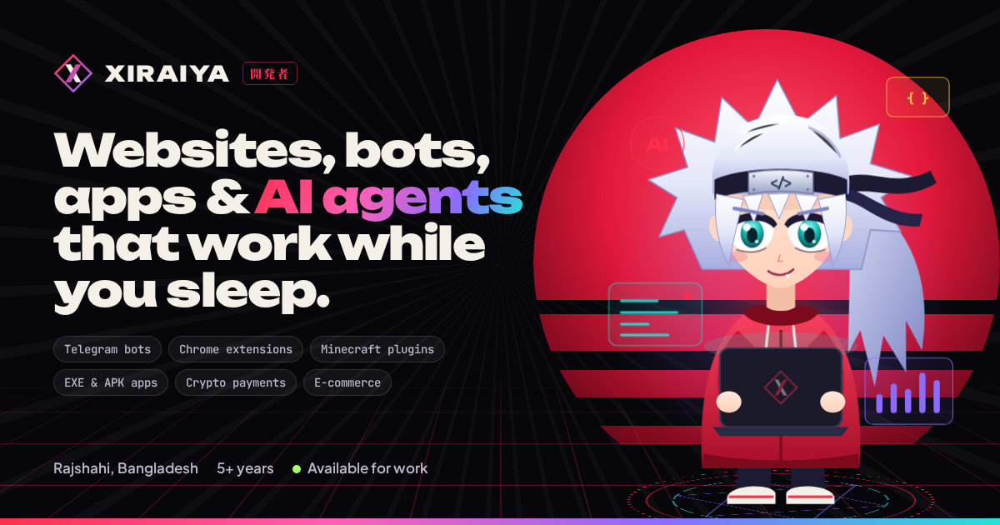

# Xiraiya — Portfolio & Live Service Showroom



The personal website of **Xiraiya**, a 21-year-old full-stack developer from Rajshahi, Bangladesh with 5+ years of experience.
It's a cinematic, ukiyo-e inspired portfolio where visitors can try a live, interactive version of every service before they hire.

- **Pure HTML, CSS and JavaScript.** No framework and no build step. Open it, edit it and deploy it anywhere.
- **No emojis.** Every icon is a custom SVG from `assets/js/icons.js`.
- **SEO-ready.** Includes meta tags, Open Graph and Twitter cards, schema.org JSON-LD, `sitemap.xml`, `robots.txt` and a web manifest.
- **Accessible.** Uses semantic HTML, a skip link, keyboard support and visible focus styles, and honours `prefers-reduced-motion`.

## Pages

| Page | What's inside |
| --- | --- |
| `index.html` | Cinematic hero with an animated anime mascot (its eyes follow the cursor), intro loader, character sheet, skill radar, 5-year timeline, 11-service bento grid, horizontal "explore" panels, process and tech stack |
| `showcase.html` (**The Lab**) | A lab-notebook layout: the hero is a book-style contents page (dotted leaders, prices, a hand-drawn tick for every demo you try), each chapter has a running header, a numbered spec list, a receipt-style price and a margin note on what to try, plus a sidebar that ticks off each demo you try, a window bar with a fullscreen **Focus** mode on every stage, J/K/F keyboard shortcuts, and a **Build your combo** price calculator that opens the Hire page with your picks selected. 11 interactive stages: live website preview, drag-and-drop automation workflow, working Telegram shop bot, Chrome extension popup that edits a page, **BlockRealm**, a playable Minecraft-style survival game (see below), desktop OS with an EXE installer and app, Android app, configurable AI agent, AI chat widget (English + Bangla), e-commerce autopilot feed and an auto-confirming crypto checkout |
| `shop.html` (**Shop templates**) | Twelve complete store templates with real product photos: clothing, baby clothes, beauty, fine jewellery, handwoven Bangladeshi wear, bags, desk tech, film cameras, sneakers, furniture, plants and outdoor gear. Each store has its own fonts, colours, hero layout, currency (৳, $, €, £, kr), lookbook, reviews and footer. Shared engine: filters, product modal with zoom and sizes, per-store bag, promo codes, shopping assistant, checkout with bKash / Nagad / card / crypto / COD, and an admin dashboard |
| `components.html` (**UI Kit**) | A specimen-sheet hero with redlined live components, then all 50 components (headers, bars, heroes, buttons, cards, forms, footers, loaders, alerts) laid out category by category on light specimen boards. A sticky category bar has search. Every component has its own panel with a live preview, notes, a Code view (HTML / CSS / JS tabs), one-click copy and a full-screen present mode. Below it: **Anatomy** (one button with measured callouts, all six states and a token panel with a live WCAG contrast check), **Motion** (a draggable cubic-bezier editor driving real UI, with copyable CSS) and release notes. Scripts: `assets/js/components.js` and `assets/js/kit-studio.js` |
| `demos.html` + `demos/` | Fifteen complete demo websites and a desktop/laptop/tablet/phone preview studio. New: **Aurèle** (fine jewellery: drag slider, ring size finder, fitting booking), **Nordhem** (furniture: shop-the-room hotspots, SVG sofa builder, room cost estimator, cart drawer), **Halide** (film cameras and lab: viewfinder hero, sunny 16 exposure calculator, lab pricing, roll tracker), **Kage Build** (gaming PCs: configurator with FPS estimates, power meter and compatibility fixes) and **Stride** (sneaker drops: countdown, size-first stock grid, raffle ticket, release calendar). Also Nova AI, Sakura Bistro, Vault, BlockRealm, Pulse, Mori Tea, Haven, Ledger, Nomad and Kumo Docs |
| `pages.html` (**Pages Studio**) | **12 complete websites to choose from** (Lumen SaaS, Aurèle jewellery, Nordhem interiors, Thread & Co menswear, Glow Theory beauty, Sobuj plants, Halide film cameras, Kage Tech PCs, Deshi Loom handloom, Field Day sports club, Pebble baby wear, Stride sneakers), each with its own copy, real photos, colours, fonts, buttons and layouts across every page (`assets/js/pages-sites.js`). Thirteen page templates (homepage, log in, sign up, pricing, dashboard, blog post, contact, 404, portfolio, product, checkout, about + team, coming soon) built from 70 section variants. It has 10 one-click theme presets (Aurora, Swiss, Brutalist, Luxe, Playful, Terminal, Paper, Ocean glass, Forest, SaaS Indigo). A toolbar swaps, reorders, hides, duplicates and adds sections. Everything can be restyled live: colours, surface tone, light/dark, 8 font pairs, radius, spacing, shadows, borders, 8 button styles with shapes, sizes and hovers, and motion effects (scroll animations, card hover, background patterns, heading styles, a sticky glass navbar). It also has Select and Text modes (text edits are kept), desktop/tablet/phone/fluid-width previews with a drag handle, undo/redo, saved versions, a Code tab with a quality audit and highlighted source, share links and one-click HTML export |
| `dev-world.html` (**Dev World**) | A developer village on an illustrated map (it turns into a starry night in ink mode) with seven buildings. It has a terminal with 40+ commands (including `curl` against the mock API, `calc`, `top`, `toadsay`, a playable `snake`, `grep` pipes and ghost autocomplete), a live HTML/CSS/JS playground with syntax highlighting, presets, a console and share links, 17 dev tools with search (JSON, regex, Base64, UUID, passwords, colours, SHA hashes, JWT, timestamps, gradients, box-shadows, Markdown, diff, cron, URL parser, case and unit converters), a mock REST API console with auth, history and fetch/curl/Python snippets, a git-graph career timeline with a heatmap, an **Algorithm Arena** (6 sorting algorithms, a 6-way race, and A*/Dijkstra/BFS/DFS pathfinding with walls, mud and mazes), a **Typing Dojo** code typing test with WPM, accuracy, ranks and best runs, and a village passport that stamps each building you use |
| `tutorials.html` (**Motion Academy**) | After Effects-style tutorial player with a keyframe engine, timeline, layers, effect controls with an easing graph, motion paths, lesson notes, live CSS export, an easing lab and code guides |
| `hire.html` | Packages, a 4-step project configurator with an instant estimate, and a brief hand-off by email, Telegram or WhatsApp. Also covers payment methods, next steps and an FAQ with FAQPage schema |
| `404.html` | Custom "lost shinobi" page |

## BlockRealm: the playable Minecraft demo

The Minecraft chapter of the Lab is a small survival game that shows off the kind of server plugin Xiraiya builds (the fictional "RealmCore" plugin):

- **Survival:** mine and place blocks, 17 crafting and smelting recipes, pickaxe tiers, ores (coal, iron, gold, diamond), caves, fall damage, health and hunger. You eat food to survive.
- **World:** day and night cycle, skylight that spreads through doors and caves, torches, rain, water, trees, a spawn house with a loot chest.
- **Mobs:** zombies that burn in daylight, creepers that explode, pigs that drop porkchops. TNT and ender pearls work too.
- **Plugin features:** coins and ore rewards, shop GUI, Legend Crates with a spinning reel, ranks, `/kit`, `/sethome` and `/home`, `/summon`, and the **Blood Moon** event with a boss bar. There are 13 advancements with toasts.
- **Controls:** keyboard and mouse on desktop, and an on-screen pad on phones. Sound effects are synthesized in the browser and can be muted.
- **Saving:** progress is saved in the visitor's browser (localStorage). "New world" in the inventory starts over.

## Phone version and extras

- On screens up to 760px wide, `assets/css/phone.css` switches to a simplified layout. It has an app-style bottom tab bar, compact home sections, one Lab chapter at a time with Prev/Next buttons, and lighter effects.
- **Command Center:** press `Ctrl K` (or `Cmd K`) or the search button to jump to any page, demo, service or action.
- **Visitor quest log:** visitors earn XP for visiting pages and trying each Lab demo. It's shown inside the Command Center, and completed quests pop up as toasts. There is also a hidden secret: the Konami code.
- **Ant World (蟻の国):** two tiny ant colonies (red Aka and black Kuro) live on every page (`assets/js/bugs.js`). They build a nest in each section, walk the edges of buttons, cards, images, the header and the footer, bite pieces out of them and carry letters home. They also swim through rain puddles and fight over nests. Everything they eat grows back, and the text stays in the page for screen readers. The ant button (bottom left) shows the war and lets visitors drop sugar, spill water, start a war, restore the site or hide the ants. Add `data-ants="off"` to a page's `<body>` to turn it off there.

## Make it yours: edit one file

Almost everything personal lives in **`assets/js/config.js`**:

```js
contact: {
  email: 'your-email@example.com',     // <- replace
  telegram: 'your_telegram_username',  // <- replace (no @)
  whatsapp: '',                         // e.g. '8801XXXXXXXXX'
  github: '', linkedin: '', fiverr: '', upwork: ''
},
stats:    { projects: 120, clients: 70, bots: 40, countries: 12 },  // <- your real numbers
packages: [ /* Spark / Blade / Legend: names, prices, features */ ],
```

`XIRAIYA_SERVICES` in the same file controls each service's name, starting price, delivery time and add-on features. The Lab, the Hire configurator and the footer all read from it.

> **Before you share the site, replace these:**
> - The placeholder email and Telegram username.
> - The stats (projects, clients and so on), which are sample numbers.
> - The package and service prices, which are sample starting prices.
>
> The 5-year timeline in `index.html` (section "01 — The character") is a sample story. Edit it to match your real journey.

Longer copy (the bio, headings and FAQ answers) is plain HTML in each page. Search for the text and edit it.

## Run it locally

```bash
npx serve .          # or: python3 -m http.server 8080
```

Then open `http://localhost:3000` (or `:8080`). Opening `index.html` directly also works.

## Deploy on GitHub Pages (free)

1. Merge this branch into `main`.
2. On GitHub, open **Settings → Pages**, set **Source: Deploy from a branch** and choose **`main` / root**.
3. The site goes live at `https://sknoyon324234234234.github.io/Personal/`.
4. Submit `https://sknoyon324234234234.github.io/Personal/sitemap.xml` in [Google Search Console](https://search.google.com/search-console).

### Using a custom domain or a different host

Canonical URLs, Open Graph images and the sitemap use the full GitHub Pages URL. Replace it everywhere in one go:

```bash
grep -rl "sknoyon324234234234.github.io/Personal/" --include=*.html --include=*.xml --include=*.txt --include=*.js . \
  | xargs sed -i 's#https://sknoyon324234234234.github.io/Personal/#https://yourdomain.com/#g'
```

## Project structure

```
index.html  showcase.html  shop.html  components.html  demos.html  pages.html  dev-world.html  tutorials.html  hire.html  404.html
demos/                 twelve standalone demo websites
assets/css/            core.css (design system), one stylesheet per page, phone.css (phone layout)
assets/js/config.js    your details, prices, services, packages
assets/js/icons.js     custom SVG icon sprite (no emoji)
assets/js/core.js      header/footer, tab bar, transitions, reveals, mascot, particles, Command Center, quests
assets/js/lab/         one script per Lab stage
assets/js/kit-data.js  UI Kit component library (HTML + CSS for each component)
assets/js/pages-kit.js Pages Studio template generator (sections, tokens, export)
assets/js/world.js     Dev World terminal, playground, toolbox, API console and git graph
assets/img/            favicon, app icons, social share image, demo thumbnails
tools/                 og.html + render-assets.js (regenerate images)
sitemap.xml  robots.txt  site.webmanifest  .nojekyll
```

## Regenerate images

Run this after you change the look of the share image, the favicon or a demo site:

```bash
npm i -D playwright && npx playwright install chromium
node tools/render-assets.js
```

## Notes

- Every shop, product, brand, person and review inside the demos is **fictional**.
- Shop product photos are real, free-licence photos (Unsplash License and Creative Commons via Openverse and Wikimedia Commons). Every photographer and licence is listed in `assets/img/shop/credits.json` and in each store's footer. `tools/build-shop-photos.js` and the `Shop photos` GitHub workflow (`tools/shop-photos/`) rebuild them.
- **No payment is ever requested or processed**: the crypto, bKash, Nagad and card flows are simulations and are labelled that way on screen. The demo wallet addresses and QR codes are decorative.
- Design: an ukiyo-e "ink and vermilion" look (warm sumi black, washi cream, seal red, gold leaf) with film-style motion. It includes letterbox bars, ink-bleed reveals, calligraphy letters, brush strokes, seal stamps and an ink-wash page transition.
- Themes: **paper** (light, default) and **ink** (dark). The moon/sun button in the header switches between them and remembers the choice. Colours live as tokens at the top of `assets/css/core.css`.
- Characters (original designs, not copies of any anime character, drawn in the kabuki / folklore tradition of the 1839 tale of Jiraiya 児雷也):
  - **Xiraiya**, the toad sage developer. He winks and waggles his eyebrows, and his toad Gama snaps flies out of the air.
  - **Tsunade**, head of QA. She has a clipboard, tea and a stamp that slams "OK".
  - **Namekuji**, a leopard slug who works customer support in a tiny headset.
  - Click any character and they tell a joke. Meet them all in "The crew" section on the home page.
- Motion: pill buttons with a fill that grows from the pointer and an arrow swap, lifting cards, inertia smooth scrolling for mouse wheels, and ink-bleed reveals.
- Fonts: Shippori Mincho B1, Zen Kaku Gothic New and JetBrains Mono from Google Fonts, loaded without blocking rendering.
- "Minecraft" is a trademark of Mojang/Microsoft and "Telegram" of Telegram FZ-LLC. The demos only use generic, original artwork.
